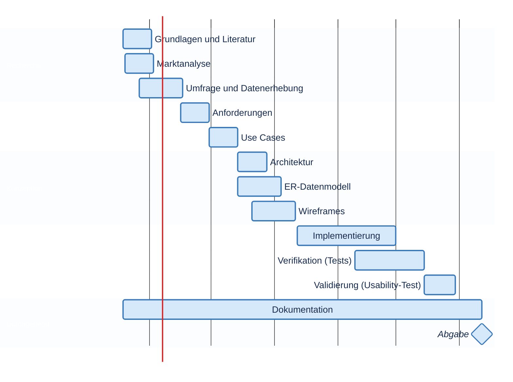

## Zeitplan

Geplanter Ablauf der Studienarbeit von Oktober 2026 bis zur Abgabe im April 2027. Die genauen DHBW-Fristen (Anmeldung und Abgabe) werden eingetragen, sobald sie feststehen.

```mermaid
%%{init: {"theme":"base","themeVariables":{"fontFamily":"Arial, sans-serif","fontSize":"14px","background":"#FFFFFF","primaryColor":"#D6E9FA","primaryTextColor":"#172B4D","primaryBorderColor":"#3978B9","secondaryColor":"#EDF4FA","tertiaryColor":"#FFFFFF","textColor":"#FFFFFF","titleColor":"#FFFFFF","sectionBkgColor":"#EDF4FA","altSectionBkgColor":"#FFFFFF","sectionTitleColor":"#172B4D","taskBkgColor":"#D6E9FA","taskBorderColor":"#3978B9","taskTextColor":"#172B4D","taskTextDarkColor":"#172B4D","taskTextOutsideColor":"#172B4D","gridColor":"#64748B","todayLineColor":"#DC2626"},"gantt":{"leftPadding":190,"rightPadding":40,"barHeight":30,"barGap":8,"topPadding":45,"fontSize":14,"numberSectionStyles":2,"useMaxWidth":true}}}%%
gantt
    title Zeitplan Studienarbeit
    dateFormat YYYY-MM-DD
    axisFormat %b %Y
    tickInterval 1month

    section Recherche
    Grundlagen und Literatur :2026-10-19, 14d
    Marktanalyse :2026-10-20, 14d
    Umfrage und Datenerhebung :2026-10-27, 21d

    section Anforderungen
    Anforderungen :2026-11-16, 14d
    Use Cases :2026-11-30, 14d

    section Konzeption
    Architektur :2026-12-14, 14d
    ER-Datenmodell :2026-12-14, 21d
    Wireframes :2026-12-21, 21d

    section Umsetzung
    Implementierung :2027-01-12, 48d
    Verifikation (Tests) :2027-02-09, 34d
    Validierung (Usability-Test) :2027-03-15, 15d

    section Durchgehend
    Dokumentation :2026-10-19, 175d
    Abgabe :milestone, 2027-04-12, 0d
```